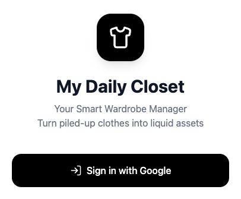

# 🧥 My Daily Closet

> **From "Piled-up Clothes" to "Liquid Assets".**

  

Current product entry screen from the live app build.

## 🌟 The Vision

The fundamental problem with modern wardrobes isn't a lack of clothes, but a lack of **inventory management** and **styling guidance**. Millions of dollars of clothing sit idle in closets worldwide, causing decision fatigue and massive retail return rates.

**My Daily Closet** is an open-source, AI-driven wardrobe manager designed to solve this. We are building a closed-loop ecosystem for your clothes: **Style -> Buy -> Sell/Donate/Upcycle**. 

By treating personal clothing as manageable inventory, we aim to eliminate decision fatigue, reduce fashion waste, and create a seamless pipeline for the circular fashion economy.

## ✨ Core Features

1. **🚀 30-Second Digitization**
   - Upload a photo, and our Multimodal AI (powered by Gemini) automatically tags the category, color, style, and season.
   - Say goodbye to tedious manual data entry.

2. **🤖 Context-Aware AI Stylist**
   - Generates daily outfit recommendations based on your actual wardrobe inventory and real-time local weather data.
   - Provides personalized styling advice, ensuring you wear more of what you own.

3. **💸 Idle Asset Monetization**
   - Automatically detects clothes that have been unworn for 90+ days.
   - Features a one-click generator for highly-converting sales copy, ready to be pasted into marketplaces like Poshmark, eBay, or Depop.
   - Turns idle wardrobe space back into liquid cash.

## 📍 Project Status

My Daily Closet is currently in the **open prototype to structured MVP** phase.

That means the repository is public, the core flows already run, and the best outside contributions are now focused stabilization passes rather than broad rewrites.

Current maintainer priorities:

- strengthen AI parsing and fallback behavior;
- smooth rough UX edges in upload, delete, and resale flows;
- improve Firebase failure handling and user feedback;
- keep bundle size, mobile behavior, and contributor onboarding under control.

## 🛠️ Tech Stack

- **Frontend:** React 19, Tailwind CSS, Motion (Framer Motion)
- **Backend/BaaS:** Firebase (Authentication, Firestore)
- **AI Engine:** Google Gemini 2.5 Flash (Multimodal)
- **APIs:** Open-Meteo (Real-time weather integration)

## 🤝 Why Open Source?

We believe that managing personal assets should be transparent and community-driven. By open-sourcing the core framework, we invite developers, fashion enthusiasts, and AI researchers globally to collaborate. 

We welcome contributions to:
- Build better background-removal and image processing algorithms.
- Integrate with local second-hand marketplaces worldwide via APIs.
- Create more personalized and diverse AI styling prompts.

## 👥 Contributors Wanted Now

We are actively looking for a small number of contributors who want to help turn the current prototype into a stable MVP.

The best fits right now are developers who can help with:

- AI response parsing tests and fallback validation
- Firebase reliability and user-facing failure handling
- non-blocking UI polish in delete, clipboard, and edit flows
- accessibility and mobile UX fixes
- narrow documentation improvements that reduce setup ambiguity

If that sounds like your area, start with [CONTRIBUTOR_START_HERE.md](CONTRIBUTOR_START_HERE.md).

## 🧭 Where Contributors Should Start

If you are evaluating whether to contribute, start here:

- [CONTRIBUTOR_START_HERE.md](CONTRIBUTOR_START_HERE.md) for the fastest project overview
- [ROADMAP.md](ROADMAP.md) for current priorities
- [GOOD_FIRST_TASKS.md](GOOD_FIRST_TASKS.md) for concrete first contributions
- [DEPLOYMENT.md](DEPLOYMENT.md) for the shortest private beta deployment path
- [GitHub Discussions](https://github.com/markkuang9-PRG/My-Daily-Closet/discussions) for contributor coordination and project updates
- [Open Issues](https://github.com/markkuang9-PRG/My-Daily-Closet/issues) for tasks ready to pick up
- [ISSUE_BACKLOG.md](ISSUE_BACKLOG.md) for ready-to-post community issue drafts
- [COMMUNITY_LAUNCH_CHECKLIST.md](COMMUNITY_LAUNCH_CHECKLIST.md) for the first public contributor push
- [FIRST_WAVE_RECRUITMENT_PLAN.md](FIRST_WAVE_RECRUITMENT_PLAN.md) for recruiting before deeper product work
- [COMMUNITY_REPLY_TEMPLATES.md](COMMUNITY_REPLY_TEMPLATES.md) for handling public replies and first contributor conversations
- [HOW_I_CAN_HELP_PUBLISH.md](HOW_I_CAN_HELP_PUBLISH.md) for what Codex can automate and what still needs your account action
- [community/publish](community/publish) for final copy-and-paste outreach posts
- [CONTRIBUTING.md](CONTRIBUTING.md) for contribution process and legal terms

The project is currently most receptive to focused improvements around MVP stabilization, workflow cleanup, Firebase reliability, prompt quality, and contributor-facing documentation.

## ⚖️ Licensing

- The source code in this repository is licensed under **AGPL-3.0-only**. See [LICENSE](LICENSE).
- Additional attribution and repository notices are collected in [NOTICE](NOTICE).
- External contributions are accepted under the terms in [CLA.md](CLA.md). This allows the project to remain open source while preserving the ability to offer commercial licenses, dual-license future versions, or complete a broader business transaction involving the project.
- Project names, logos, and brand assets are not automatically licensed with the source code. See [TRADEMARKS.md](TRADEMARKS.md).
- Project governance, maintainer authority, and contribution boundaries are described in [GOVERNANCE.md](GOVERNANCE.md).
- Community behavior expectations are described in [CODE_OF_CONDUCT.md](CODE_OF_CONDUCT.md).
- Private security reporting guidance is described in [SECURITY.md](SECURITY.md).
- Commercial licensing and private business inquiries are described in [COMMERCIAL-LICENSING.md](COMMERCIAL-LICENSING.md).
- Support paths are described in [SUPPORT.md](SUPPORT.md).

For commercial licensing, OEM use, private deployments that need terms outside AGPL, or other business inquiries, contact the project owner before use.

## 🚀 Getting Started

\`\`\`bash
# Clone the repository
git clone https://github.com/markkuang9-PRG/My-Daily-Closet.git

# Install dependencies
npm install

# Set up your .env file with your Gemini API Key
# VITE_GEMINI_API_KEY=your_key_here

# Run the development server
npm run dev
\`\`\`

For private beta deployment, follow [DEPLOYMENT.md](DEPLOYMENT.md).

## 📣 How to Help the Project Grow

If you want to support the project without writing code yet:

- open focused bug reports with reproduction steps;
- propose narrowly-scoped improvements tied to the roadmap;
- share the repository with React, Firebase, AI tooling, and circular-fashion communities;
- join or reply in [GitHub Discussions](https://github.com/markkuang9-PRG/My-Daily-Closet/discussions) so other contributors can see active maintainer presence;
- point first-time contributors to [CONTRIBUTOR_START_HERE.md](CONTRIBUTOR_START_HERE.md).

---
Copyright (c) 2026 Piedra Roja Group, Inc. and contributors.
